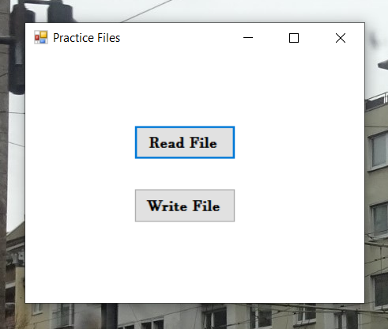
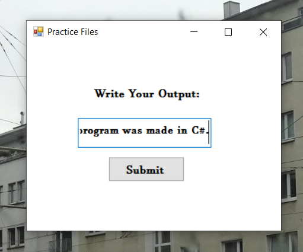
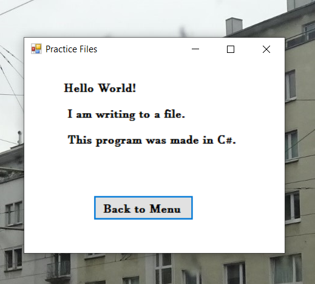

# Working-With-Files-in-C-
This program is a C# application that allows you to write to and show the contents of a particular file.

In This App You Can:

# Select whether to write to or to read the file from the start menu

# Write text and save it into the file

# Read the text from the file

